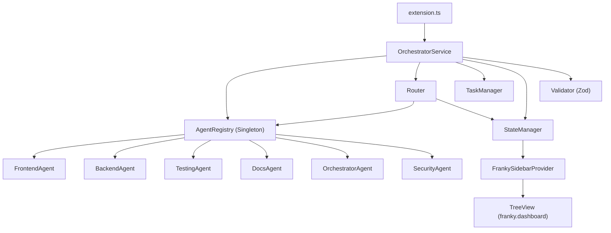

# FASE 1 — Multi-Agent Orchestrator Specification

> **Status:** ✅ Implementado  
> **Autor(es):** Omar (Lead), Antigravity (AI)  
> **Fecha:** 2026-02-13  
> **Branch:** `develop`

---

## 1. Objetivo

Construir la infraestructura de orquestación multi-agente de Franky 3.0:
un sistema modular que registra, gestiona, y enruta mensajes a agentes especializados,
con un sidebar dinámico que muestra el estado en tiempo real.

## 2. Arquitectura



## 3. Componentes

### 3.1 Agent Framework (`src/franky/agents/`)

| Archivo                 | Propósito                                                                                |
| ----------------------- | ---------------------------------------------------------------------------------------- |
| `agent-types.ts`        | Tipos compartidos: `AgentCapability`, `AgentMessage`, `AgentResponse`, `AgentDescriptor` |
| `base-agent.ts`         | Clase abstracta `BaseAgent` con lifecycle (init/dispose), capability check, helpers      |
| `agent-registry.ts`     | Singleton `AgentRegistry` para registro, descubrimiento, y gestión de agentes            |
| `frontend/index.ts`     | Agente UI/UX (code_gen, ui_design, refactoring)                                          |
| `backend/index.ts`      | Agente Backend (code_gen, architecture, refactoring)                                     |
| `testing/index.ts`      | Agente QA (testing, code_review, debugging)                                              |
| `docs/index.ts`         | Agente Documentación (documentation)                                                     |
| `orchestrator/index.ts` | Meta-agente (orchestration, architecture)                                                |
| `security/index.ts`     | Agente Seguridad (security_audit, code_review)                                           |
| `index.ts`              | Barrel export del módulo                                                                 |

### 3.2 Orchestrator Core (`src/franky/orchestrator/`)

| Archivo                   | Propósito                                                                 |
| ------------------------- | ------------------------------------------------------------------------- |
| `state-manager.ts`        | Estado reactivo: phase, activeTask, agentStatuses + listeners             |
| `task-manager.ts`         | CRUD de tareas con lifecycle (pending→executing→completed/failed)         |
| `validator.ts`            | Validación Zod: AgentMessageSchema, AgentResponseSchema, CreateTaskSchema |
| `router.ts`               | Enrutamiento: directo (por tipo), por capability, broadcast (fan-out)     |
| `orchestrator-service.ts` | Entry point: wire de registry + router + state + tasks + validator        |
| `index.ts`                | Barrel export del módulo                                                  |

### 3.3 Sidebar (`src/franky/components/`)

| Archivo               | Propósito                                                                       |
| --------------------- | ------------------------------------------------------------------------------- |
| `sidebar-provider.ts` | `FrankySidebarProvider` — TreeDataProvider dinámico con estado del orchestrator |

### 3.4 Integración (`extension.ts`)

- Importa `OrchestratorService` y `FrankySidebarProvider` con `await import()` (lazy)
- Boota el orchestrator y registra los 6 agentes
- Registra el TreeView `franky.dashboard` con refresh reactivo
- Comandos: `franky.showOutput`, `franky.orchestratorStatus`
- Disposal limpio vía `context.subscriptions`

## 4. Tipos Clave

```typescript
type FrankyAgentType = "frontend" | "backend" | "testing" | "docs" | "orchestrator" | "security"
type AgentCapability =
	| "code_generation"
	| "code_review"
	| "testing"
	| "documentation"
	| "security_audit"
	| "architecture"
	| "debugging"
	| "refactoring"
	| "orchestration"
	| "ui_design"
type AgentStatus = "idle" | "busy" | "error" | "disabled"
type OrchestratorPhase = "idle" | "planning" | "executing" | "reviewing" | "completed" | "error"
```

## 5. Tests (`src/franky/__tests__/`)

| Test Suite               | Cobertura                                                                    |
| ------------------------ | ---------------------------------------------------------------------------- |
| `agent-registry.test.ts` | Singleton, register/unregister, capability lookup, descriptors, init/dispose |
| `state-manager.test.ts`  | Phase transitions, agent statuses, errors, reset, listeners, unsubscribe     |
| `task-manager.test.ts`   | CRUD, status lifecycle, active count, filtering, clear                       |
| `validator.test.ts`      | Message validation, task creation, response validation, edge cases           |
| `router.test.ts`         | Direct routing, capability routing, broadcast, error handling, state updates |

**Resultado:** 5/5 suites passed ✅

## 6. Archivos Creados (24 nuevos)

```
src/franky/
├── agents/
│   ├── agent-types.ts
│   ├── base-agent.ts
│   ├── agent-registry.ts
│   ├── index.ts
│   ├── frontend/index.ts
│   ├── backend/index.ts
│   ├── testing/index.ts
│   ├── docs/index.ts
│   ├── orchestrator/index.ts
│   └── security/index.ts
├── orchestrator/
│   ├── state-manager.ts
│   ├── task-manager.ts
│   ├── validator.ts
│   ├── router.ts
│   ├── orchestrator-service.ts
│   └── index.ts
├── components/
│   └── sidebar-provider.ts
└── __tests__/
    ├── agent-registry.test.ts
    ├── state-manager.test.ts
    ├── task-manager.test.ts
    ├── validator.test.ts
    └── router.test.ts
```

## 7. Archivos Modificados (2)

- `extension.ts` — Wiring del OrchestratorService + FrankySidebarProvider + commands
- `package.json` — View `franky.dashboard` + command `franky.orchestratorStatus`

## 8. Exclusiones (FASE 2+)

- T100 (Semantic Engine / Tree-sitter / embeddings)
- T13 (Session Memory Refactor / Qdrant)
- GPU/embedding pipelines
- Agent inter-communication (agent-to-agent messaging)
- Real AI model integration within agents

## 9. Próximos Pasos

1. **FASE 2:** Implementar lógica real en cada agente (desacoplar de stubs)
2. **FASE 2:** Agent-to-agent messaging vía Router
3. **FASE 2:** T100 Semantic Engine (Tree-sitter + embeddings)
4. **FASE 3:** Session Memory (Qdrant integration)
